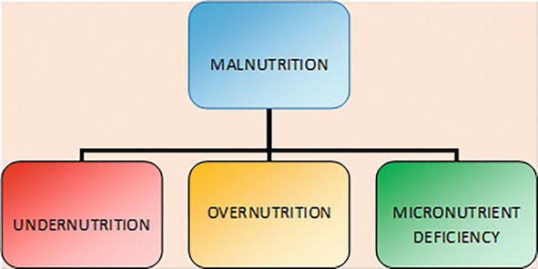
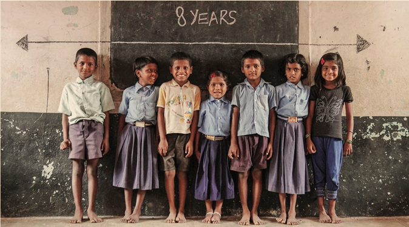
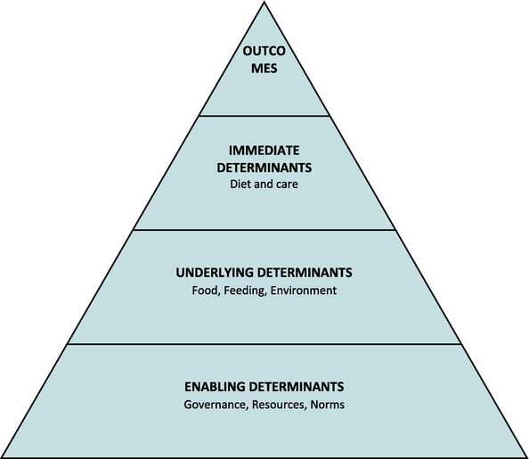
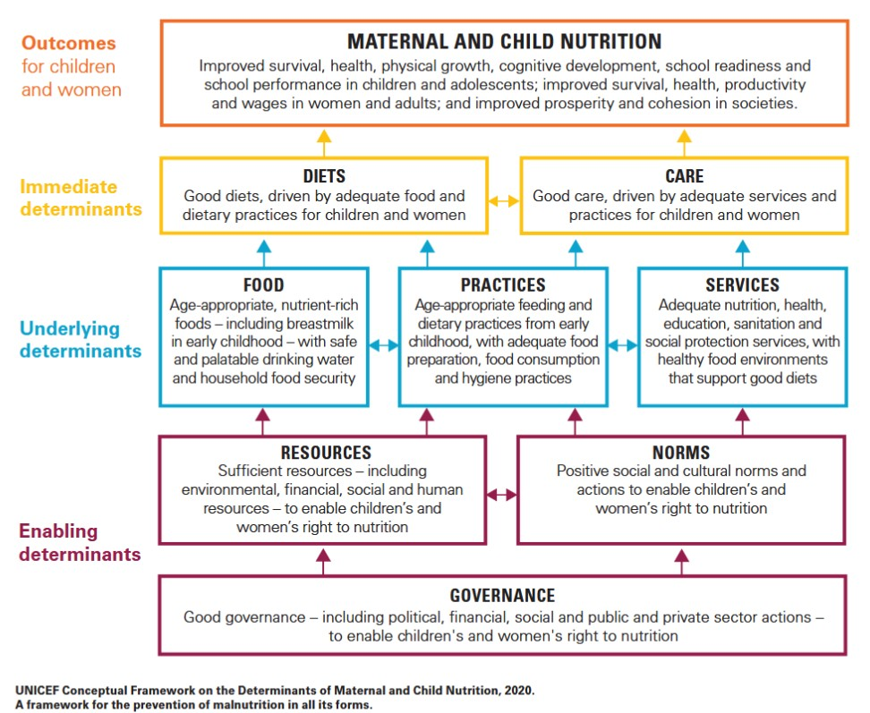
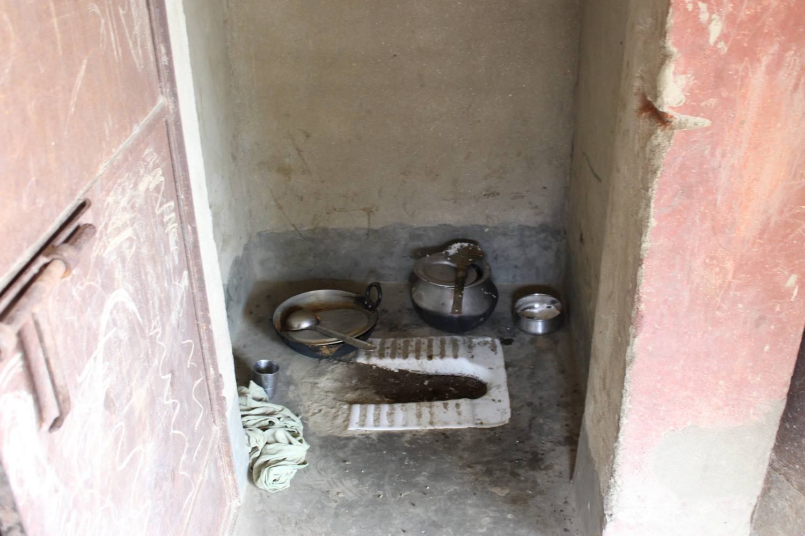
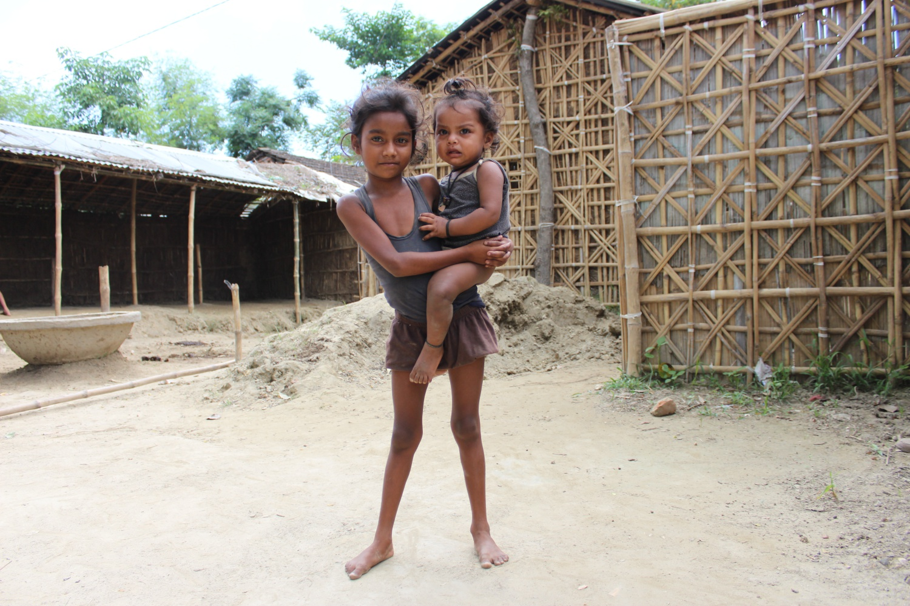
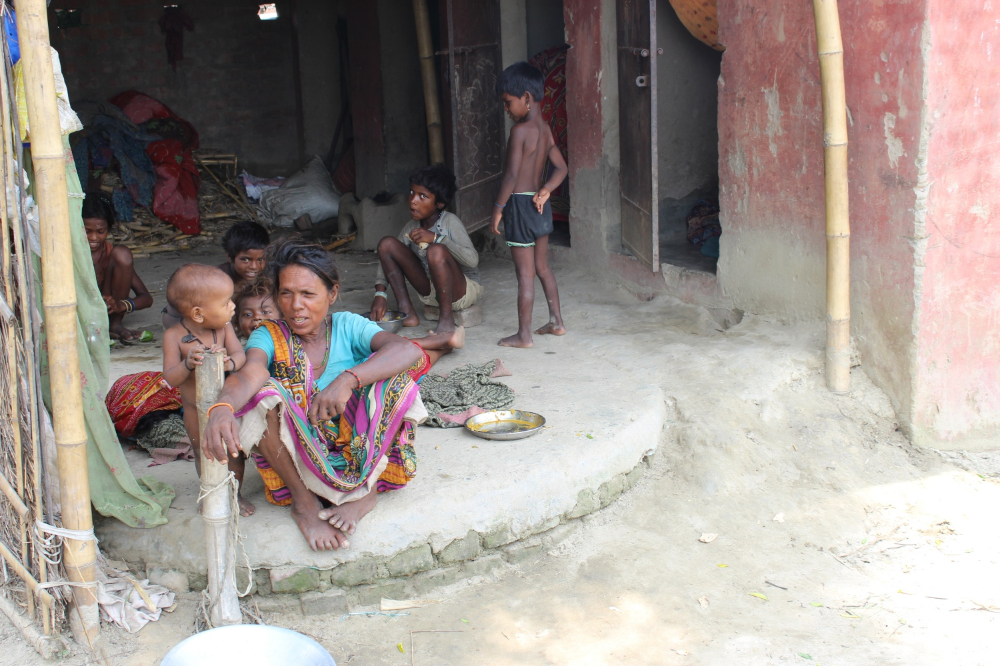
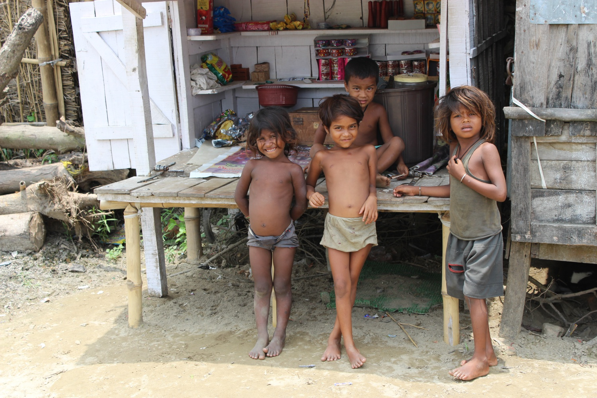
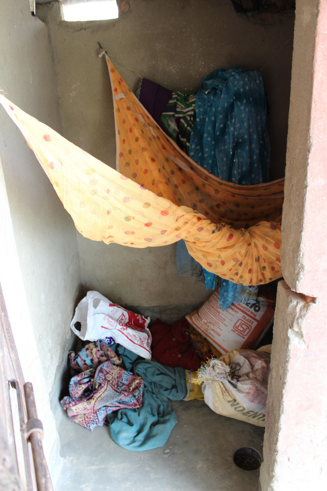
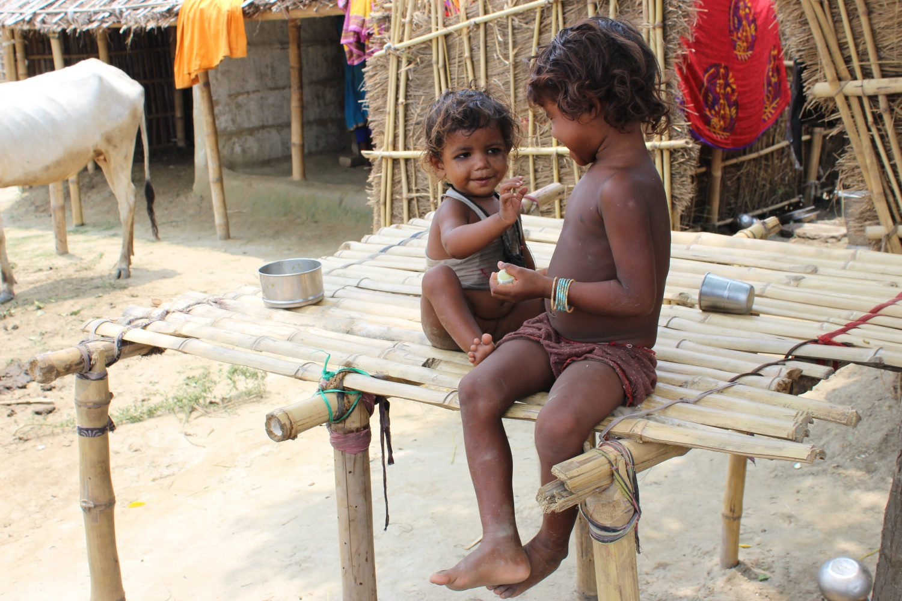

## Session Roadmap

- Definitions & the spectrum of malnutrition (including the double burden)
- Why malnutrition matters
- Magnitude: global and India (NFHS-6)
- Why does it happen? Multifactorial causation (UNICEF framework)
- Bridge to Lecture 2: clinical forms, assessment, and management

::: {.notes}
Opening slide. State the two-lecture structure: today (L1) is "what is it, how big, and why"; Lecture 2 is "what are its clinical forms, how do we measure it, and what do we do about it." ~1 min.
:::

---

## Learning Objectives

By the end of this session, you should be able to:

1. Define malnutrition and describe its full spectrum, including the double burden
2. State the current magnitude of malnutrition in India (NFHS-6) and globally
3. Explain the multifactorial causation of malnutrition using the UNICEF conceptual framework
4. Justify why a multifactorial problem requires a multisectoral response (bridge to Lecture 2)

::: {.notes}
Read through quickly — these map directly to your formative MCQs at the end and to likely SAQs in your university exam. Clinical forms, assessment, and management are the subject of Lecture 2. ~1 min.
:::

---

## What Is Malnutrition?

WHO definition: deficiencies, excesses, or imbalances in a person's intake of energy and/or nutrients.

- Malnutrition has two broad arms: undernutrition and overnutrition
- WHO's 2023 clinical framing groups wasting and nutritional oedema together as "acute malnutrition"; the terminology has shifted from purely descriptive ("PEM") toward this functional grouping

::: {.notes}
Emphasize: malnutrition is not synonymous with "starvation" — it is any imbalance, in either direction. This is the conceptual foundation for everything that follows. ~2 min.
:::

---

## The Spectrum of Malnutrition

:::: {.columns}
::: {.column width="55%"}
Three overlapping domains, each of which can occur alone or together:

1. Undernutrition: stunting, wasting, underweight
2. Micronutrient malnutrition: vitamin/mineral deficiencies ("hidden hunger")
3. Overweight and obesity

:::
::: {.column width="45%"}

:::
::::

::: {.notes}
Draw or show the branching diagram. Answer the opening hook here: the three children each sit in a different domain of the same overall spectrum. ~2 min.
:::

---

## Key Undernutrition Terms {.smaller}

:::: {.columns}
::: {.column width="58%"}

| Term | What it measures | Time course |
|---|---|---|
| Stunting | Low height-for-age | Chronic: accumulated over months to years |
| Wasting | Low weight-for-height | Acute: recent, rapid weight loss |
| Underweight | Low weight-for-age | Composite: reflects both chronic and acute |

:::
::: {.column width="42%"}

:::
::::

::: {.notes}
This table is foundational — students confuse these terms constantly. Drill the distinction: stunting = height problem = chronic; wasting = weight problem = acute. Underweight mixes both signals, which is why WHZ/HAZ are preferred individually. ~3 min.
:::

---

## The Double Burden of Malnutrition

Definition: the coexistence of undernutrition and overnutrition, at the population, household, or individual level.

- A country can have stunted children and obese adults at the same time
- A single household can have an underweight grandmother and an overweight child
- NFHS-6 shows this pattern emerging in India: adult BMI is worsening at both ends of the distribution at once

This is a hallmark of countries undergoing nutrition transition.

::: {.notes}
Note this is increasingly the Indian reality, not just a textbook curiosity. Overnutrition and the drivers of the double burden are developed further in Lecture 2. ~2 min.
:::

---

## Why Malnutrition Matters

- Mortality: undernutrition is an underlying factor in a large share of under-5 deaths globally
- Development: impaired cognition, poorer school performance, reduced adult productivity
- Intergenerational cycle: an undernourished girl is more likely to become an undernourished mother of an undernourished child
- Economic cost: lost productivity and higher healthcare costs at the national level

::: {.notes}
Keep this brief — it's the "why should you care" slide before we move into numbers. ~2 min.
:::

---

# Magnitude {.inverse background-color="#1a3a5c"}

**Section 1 · How big is the problem?**

---

## Global Burden (2022 estimates)

Per the UNICEF/WHO/World Bank Joint Malnutrition Estimates (2023 edition):

- ~45 million children under 5 were wasted (~6.8%)
- ~13.7 million were severely wasted
- Global targets: wasting <5% by 2025, <3% by 2030
- Current trajectory: off track for both targets

::: {.notes}
Numbers are large enough to feel abstract — try to anchor them (e.g., "roughly the population of a mid-sized Indian state, in wasted children alone"). ~2 min.
:::

---

## India: Child Undernutrition (NFHS-6, 2023–24)

| Indicator | NFHS-5 (2019–21) | NFHS-6 (2023–24) | Change |
|---|---|---|---|
| Stunting | 35.5% | **29.3%** | ↓ ~17% relative |
| Wasting | 19.3% | **19.0%** | Essentially unchanged |
| Severe wasting | 7.7% | **5.2%** | ↓ ~32% relative |
| Underweight | 32.1% | **31.8%** | Marginal |

::: {.notes}
Walk through each row. The headline story: real progress on stunting and severe wasting, but wasting overall has *plateaued* — this is the number to flag as concerning, since wasting is the most mortality-linked indicator. NFHS-6 fact sheets released 29 May 2026 — this is genuinely new data for your students. ~4 min.
:::

---

## India: Feeding Practices & the Anaemia Gap

- Only 15.3% of children aged 6–23 months receive an adequate diet
- Exclusive breastfeeding fell from 63.7% (NFHS-5) to 55.8% (NFHS-6), a concerning reversal rather than an improvement
- Anaemia (still reported from NFHS-5, since NFHS-6 dropped haemoglobin testing):
  - Children 6–59 months: ~67%
  - Women 15–49 years: ~57%
  - Pregnant women: ~52%

::: {.notes}
Flag explicitly: NFHS-6 did not measure anaemia, so we are citing NFHS-5 figures pending ICMR's Diet & Biomarkers Survey (DABS-I) with venous sampling. This is a genuine, currently-unresolved data gap worth naming rather than glossing over. ~3 min.
:::

---

## The Inequity Gradient

Malnutrition is not evenly distributed. It is consistently higher among:

- The lowest wealth quintile
- Rural populations
- SC/ST and tribal communities

There is also wide state-level variation hidden behind the national averages shown above.

Question for you: if you're posted to a tribal PHC after internship, what would you expect to find?

::: {.notes}
This is the pivot slide — end here by posing the "why" question that the next section answers. Connect explicitly to RHTC/tribal field postings your students will do. ~2 min.
:::

---

# Why Does Malnutrition Happen? {.inverse background-color="#1a3a5c"}

**Section 2 · Multifactorial causation**

---

## The UNICEF Conceptual Framework {.smaller}

Malnutrition is never caused by food alone. It results from a hierarchy of interacting causes: immediate (child level), underlying (household level), and basic or root (societal level). Originally developed in 1990; revised in 2020 to add ecosystems, climate change, and humanitarian or fragile-context shocks.

::: {.panel-tabset}

### Simplified

{height="380"}

### Full framework (UNICEF 2020)

{height="380"}

:::

::: {.notes}
This is the single most important conceptual slide in the lecture — it explains everything from the inequity gradient just shown to the programme design in Lecture 2. Draw the pyramid: root causes at the base (widest), underlying in the middle, immediate at the top (narrowest, closest to the child). Take your time here — ~4 min.
:::

---

## Immediate Causes (Child Level)

Two direct causes, acting in both directions:

1. Inadequate dietary intake: insufficient quantity, poor quality, low feeding frequency
2. Disease: infections (diarrhoea, acute respiratory infection, measles) reduce appetite, increase nutrient losses, and impair absorption

Each worsens the other: a child with poor intake is more susceptible to infection, and infection further reduces intake and absorption.

::: {.notes}
This bidirectionality is worth emphasizing now — we return to it in detail two slides from now as the "malnutrition-infection cycle." ~2 min.
:::

---

## Underlying Causes (Household/Family Level) {.smaller}

:::: {.columns}
::: {.column width="62%"}
Three pillars, all of which must be adequate at the same time:

1. Household food insecurity: access, availability, and affordability of food
2. Inadequate maternal and child-care practices: breastfeeding, complementary feeding, psychosocial stimulation, hygiene
3. Unhealthy household environment and inadequate health services: water, sanitation, housing, access to and quality of care

A deficit in any one of these three can produce malnutrition, even if the other two are adequate.
:::
::: {.column width="38%"}
{height="200"}

{height="200"}
:::
::::

*Author's own field photographs.*

::: {.notes}
Common exam point: students often only remember "food insecurity" and forget care practices and WASH/health-service access as equally weighted pillars. Emphasize all three are necessary, none is sufficient alone. ~3 min.
:::

---

## Basic (Root) Causes (Societal Level)

The broadest and most distal layer, and ultimately the most influential:

- Economic: poverty, unemployment, low agricultural productivity
- Political and institutional: governance quality, policy priorities, resource allocation
- Sociocultural: gender inequity, maternal education, harmful practices, intra-household food distribution
- Environmental: climate, ecology, access to land and water

::: {.notes}
Preview Lecture 2 explicitly here. This slide is the conceptual bridge between the two lectures. ~3 min.
:::

---

## The Malnutrition-Infection Vicious Cycle

A self-reinforcing loop, first systematically described by Scrimshaw, Taylor & Gordon:

- Malnutrition → impaired immunity → more frequent and more severe infections
- Infection → anorexia, nutrient losses, malabsorption → worsens malnutrition

Breaking this cycle requires addressing both sides at once: nutritional support alone, or infection control alone, is insufficient.

::: {.notes}
Show as a circular diagram if possible. Link forward: this is exactly why WHO's SAM management protocol (Lecture 2) treats infection *and* feeding together, not sequentially. ~2 min.
:::

---

## Determinants in Tribal & Underserved Settings

Applying the framework to the field settings many of you will work in:

- Geographic access: terrain, distance to the nearest functional facility
- Food security shaped by seasonality: forest and agriculture dependence, lean seasons
- ICDS/Anganwadi reach and functionality: coverage gaps, last-mile worker availability
- Cultural feeding practices and health-seeking behaviour

::: {.notes}
Ground the abstract framework in something concrete and field-relevant — directly useful for RHTC postings. Avoid generalizing "tribal" as monolithic; practices vary widely by community and region. ~3 min.
:::

---

## From the Field {.smaller}

:::: {.columns}
::: {.column width="50%"}
{height="200"}

{height="200"}
:::
::: {.column width="50%"}
{height="200"}

{height="200"}
:::
::::

*Photo Courtesy: Reuters.*

::: {.notes}
These are my own field photographs from a rural/tribal setting. Use them to make the abstract framework tangible: point to the cooking/storage conditions, the makeshift cradle (care practices), the children's apparent nutritional status, and how far these homes sit from a functional facility. ~2 min.
:::

---

## Why This Framework Matters

- It explains why single-sector interventions often fail: food supplementation alone, without attention to care practices or WASH, has limited impact
- Malnutrition is multifactorial, so the response must be multisectoral
- Bridge to Lecture 2: we will see how India's nutrition programmes are structured around these three causal tiers

::: {.notes}
Closing slide for this section — reinforces the takeaway and sets up L2 explicitly. ~2 min.
:::

---

## Key Takeaways

- Malnutrition is a **spectrum** — undernutrition, micronutrient deficiency, and overnutrition — not simply "not enough food"; the **double burden** is increasingly the Indian reality
- **NFHS-6:** real progress on stunting and severe wasting, but wasting has **plateaued**, exclusive breastfeeding is **falling**, and diet quality remains poor
- Causation is **multifactorial** — immediate, underlying, and basic causes interact — so the response must be **multisectoral**
- The malnutrition–infection cycle means feeding and infection control must be tackled together

::: {.notes}
Recap slide — go through each point briefly, then move to formative questions. ~2 min.
:::

---

## Formative Questions

1. Name the three overlapping domains of the malnutrition spectrum.
2. Which NFHS-6 child indicator has essentially plateaued, and why is that concerning?
3. Name the three tiers of the UNICEF conceptual framework of causation.

::: {.notes}
Use a show-of-hands or clicker poll. Answers: (1) undernutrition, micronutrient deficiency, overweight/obesity; (2) wasting — it is the most mortality-linked indicator; (3) immediate, underlying, basic/root causes. ~3 min.
:::

---

## Up Next — Lecture 2

**Clinical forms, assessment & management**

- Forms of undernutrition (PEM): marasmus, kwashiorkor, and the classification systems
- Micronutrient deficiencies and "hidden hunger"
- Nutritional assessment: the ABCD framework
- Management of SAM and India's nutrition programmes (POSHAN 2.0)

::: {.notes}
Bridge to next session — the causal framework from today directly explains the assessment tools and programme design you'll see next time. ~1 min.
:::

---

## Thank You {.inverse background-color="#1a3a5c"}

Questions and discussion welcome.

*Malnutrition, Lecture 1 of 2 · Community Medicine*
